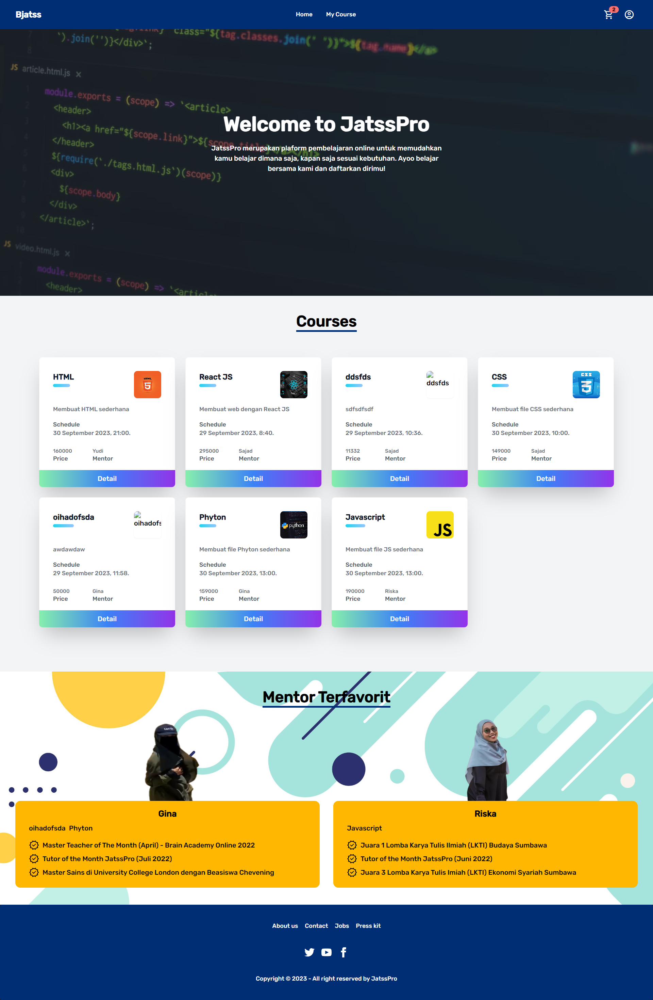

# JatssPro

A web based application to learn to be programmer

## Features

### Admin

1. [x] CRUD products by admin side
2. [x] Create zoom link meeting
3. [x] Add, Delete, Edit course

### Public

1. [x] Add course to favourite
2. [x] Pay course
3. [x] Get zoom meet link after payment

## Tech Stack

1. Vue
2. Zoom API
3. Tailwind
4. Sequelize
5. Express
6. PostgreSQL
7. Node.js
8. Axios
9. AWS
10. Pinia
